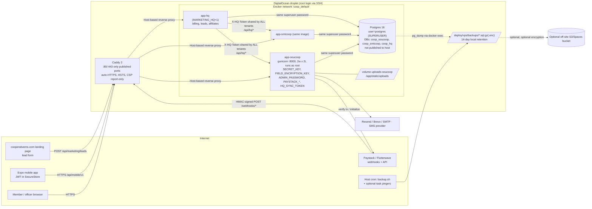

# CoopMS — Security & Architecture Audit (Phase 1)

| | |
|---|---|
| **Date** | 2026-10-07 |
| **Scope** | Entire repository at `main` (`41bc7bd`), incl. `deploy/vps/`, `mobile/coopms-mobile/`, tests, docs, git history |
| **Method** | Static review of code, config, dependencies and git history, plus dynamic tests against a **local throw-away Postgres 16 with seeded test data** (nothing was sent to production, staging, `cooperativems.com` or any live host; mail/SMS disabled) |
| **Code changes** | None to the application. New files only: this report and `security-tests/` |
| **Reviewer's note on scope** | See §0 — the stack in the brief is not the stack in this repository |

---

## 0. Read this first: the repository is not the stack described in the brief

The brief describes React + Node.js + TypeScript + Prisma, four containers named `smt_api / smt_db / smt_frontend / smt_nginx`, at `/opt/smt-coop`. **None of that exists in this repository.** What is here, and what I audited:

| Brief | Actual |
|---|---|
| React + Node + TypeScript | **Python 3.11 / Flask 2.3**, server-rendered Jinja templates (193 `.html`), gunicorn |
| Prisma ORM, `prisma migrate` | Hand-written SQL through a thin DB wrapper (`database.py`); schema created/altered by `init_db()` on every boot; no Prisma, no Alembic |
| `smt_*` four-container compose | `deploy/vps/`: **Caddy → one `app-<client>` container per cooperative → one shared Postgres 16** (databases `coop_<client>`), on a DigitalOcean droplet at `~/oou_cooperative_system/deploy/vps`. `smt` in the repo is just a client name (`smtcoop`). |
| React frontend | No SPA. The only JS/TS app is the **Expo/React-Native mobile app** (`mobile/coopms-mobile`), which I reviewed lightly (token storage, dependencies) |

Consequences for this report:
* Prisma-specific items (B13 `migrate reset / db push`, `$queryRaw`) are answered in their Flask equivalent (§B13, §B5).
* React-specific items (B7) are answered for the Jinja templates and the Expo app.
* **If your live server really runs the `smt_*` stack, it is a different codebase from this one and this audit does not cover it.** Please confirm which repo is deployed (§6, item 1).

**Rules-of-engagement deviation (disclosed):** Docker Desktop's engine was not running on the audit machine, so I did not use Docker Compose. I ran a throw-away **PostgreSQL 16.11 cluster bound to 127.0.0.1:55432** (same major version as production's `postgres:16-alpine`) and drove the real Flask app in-process. The harness hard-refuses to run against anything but a loopback database named `coop_sectest*`.

---

## 1. Executive summary (for the CFO)

**Overall exposure: HIGH.**

CoopMS has a well-built front door: members cannot see each other's money, the permission checks that decide who may do what are enforced on the server, payment-gateway callbacks are cryptographically verified, and every database query we inspected is safely parameterised. **We found no way for one member to read another member's records, and no way for one cooperative to read another through the web application.** That is the hardest part, and it is done well.

The exposure is high because of what sits *behind* the front door — the shared infrastructure, the safety nets, and housekeeping that has not caught up with the fact that this system holds members' money:

1. **One master key opens every cooperative's database.** All cooperatives' data sits in one database server, and every cooperative's application connects with the same all-powerful administrator login. A single break-in to *any one* cooperative's application would expose *every* cooperative's records — and let an attacker run commands on the database server.
2. **The source code, and some old passwords, are public.** The GitHub repository is public. Its history contains a database connection string with a password and other credentials. They must be treated as already stolen, and rotated.
3. **The record of "who did what" is unreliable, and one button erases everything.** In our tests, loan repayments, member deletions, savings deposits, password resets and user-role changes were *not* written to the audit trail (a coding slip drops the entry). Separately, a single admin click (type "PURGE ALL DATA") deletes every member, loan, deposit, the whole ledger **and the audit log itself** — no second approval, no backup first.
4. **Money handling is fragile.** Amounts are stored as floating-point numbers; typing the text "nan" as an amount corrupts a member's or a loan's balance for good; two repayments arriving at the same instant can leave the balance wrong; double-clicking "save deposit" posts it twice. One admin can approve a loan through all three approval stages alone. Only loan approvals have any approval chain; deposits, repayments, reversals and bulk uploads are done by one person with no second pair of eyes.
5. **Out-of-date software and sessions that can't be switched off.** Several libraries have published security flaws (including the image library that processes members' photo uploads). A staff member an admin disables keeps working until they log out; a mobile login token stays valid for 24 hours regardless, and the mobile app lets staff skip two-factor.

**None of this has been shown to have been exploited** — we can only see the code, not the live server's logs. Most of the serious items are quick to fix (Phase A, two weeks) and are listed in §8.

---

## 2. Architecture

### 2.1 Data-flow diagram



### 2.2 Ports, credentials and trust (production = `deploy/vps`)

| Component | Published to internet? | Credentials / secrets it holds |
|---|---|---|
| Caddy | **80, 443** (only published ports) | TLS keys (Caddy volume) |
| `app-<client>` | No (internal :8000) | `SECRET_KEY` (signs sessions **and** mobile JWTs), `FIELD_ENCRYPTION_KEY` (decrypts BVN/NIN/bank fields), `ADMIN_PASSWORD`, Paystack/mail keys, **`DATABASE_URL` as Postgres superuser**, **`HQ_SYNC_TOKEN` (same value in every client)** |
| Postgres | No (comment in `docker-compose.yml:23`) | One superuser password in `deploy/vps/.env`; databases for **all** clients |
| Backups | n/a | Dumps contain all PII and the plaintext gateway/SMTP/SMS keys stored in `settings` |

> ⚠️ The repository root also contains a **legacy `docker-compose.yml` + `nginx.conf`** (not the production path per `deploy/vps/README.md`) that publishes Postgres 5432, Redis 6379, Elasticsearch 9200, Kibana, Flower, Prometheus, Grafana and **Portainer with `/var/run/docker.sock`**, with the literal password `cooppass`. If it was ever run on the live host that would be Critical. See §6.

### 2.3 Is the monolith the problem?

**No — the structure is not the risk; the lack of internal separation and least privilege is.**

* The *tenant* boundary is actually the strongest design decision: **database-per-client plus container-per-client** means there is no `tenant_id` to forget in a `WHERE` clause. (Cross-tenant tests are therefore about credentials, not queries — see TEN-01.)
* The weaknesses are inside the monolith: business rules live inside route handlers (`blueprints/loans.py` 1,371 lines; `portal.py` 1,834; `ctas.py` 2,348), the same rules are re-implemented for web, portal and mobile, there is no service layer between HTTP and money-moving SQL, and there is no transaction/locking discipline (only 3 `FOR UPDATE` in the whole code base).
* Everything runs with one all-powerful DB identity.

**Recommendation for a 1–2 person team: a *modular monolith* with one worker process — not microservices.**
1. Keep one Flask app per client (already the case).
2. Move money-moving operations (post deposit, post repayment, disburse, reverse, adjust) into a single `services/` module that: opens one transaction, locks the rows it reads (`SELECT … FOR UPDATE`), uses `Decimal`/integer kobo, writes the audit row *inside* the same transaction, and is the only code allowed to touch `savings`, `repayments`, `loans.balance`, `journal_*`. Routes become thin.
3. Give each client its **own least-privilege DB role** (`CONNECT` on its DB only; no `SUPERUSER`, `CREATEDB`, `COPY PROGRAM`); keep a separate migrator role.
4. Run the already-designed scheduled jobs (loan sweep, CTAS charges, reminders) in one small worker/cron container with its own limited credentials rather than token-guarded public URLs.
5. Microservices would multiply the secrets, deploys and failure modes you have to run alone, without fixing any finding below.

### 2.4 Blast radius if an `app-<client>` container is compromised

*Assumes code execution inside the container (e.g. via an unpatched Pillow/Werkzeug flaw — §F-08 — or a future bug).*

| Asset | What the attacker gets |
|---|---|
| **Database** | `postgres` **superuser** to a server hosting *every* cooperative: read/modify/delete **all** clients' data; read server files; `COPY … PROGRAM` = shell inside the Postgres container. *Confirmed in test TEN-01 (role is superuser; another client's DB opens with the same credentials).* |
| **Secrets in env** | `SECRET_KEY` → forge any session/JWT for **that** client; `FIELD_ENCRYPTION_KEY` → decrypt every BVN/NIN/bank number for that client; `ADMIN_PASSWORD`; payment & mail keys; **`HQ_SYNC_TOKEN` → suspend or alter every other client via `/api/hq/*`**. |
| **Network** | Unrestricted outbound (data exfiltration); can reach Postgres and the other `app-*` containers on the Docker network. |
| **Host** | Container runs as **root** (no `USER` in `deploy/vps/Dockerfile`), but no `docker.sock`, no privileged flag, no host mounts other than the uploads volume ⇒ host escape needs a runtime/kernel bug. Good. |
| **Files** | Read/write the client's uploads volume (member photos, payout evidence). |

Net: compromise of **one** client is, today, compromise of **all** clients.

---

## 3. Findings

Legend — **Confirmed**: demonstrated by a running test in `security-tests/` (test ID shown). **Code**: established by reading code/config only. Effort: S ≤ ½ day, M ≈ 1–3 days, L ≈ 1–2 weeks.

### Critical

| ID | Area | Evidence | How established | Risk in plain English | Mitigation | Effort |
|---|---|---|---|---|---|---|
| **F-01** | DB privilege / tenant isolation | `deploy/vps/generate.py:68` gives every app `postgresql://postgres:…@postgres/coop_<n>`; `deploy/vps/docker-compose.yml` Postgres user `postgres`. Test **TEN-01**: role is `rolsuper=True`; another client's DB opens with the same credentials | **Confirmed** (locally replicated; production wiring by code) | Break into one cooperative's app ⇒ you hold the keys to every cooperative's database, and can run commands on the DB server. | Create a role per client (`CREATE ROLE coop_x LOGIN NOSUPERUSER …; REVOKE CONNECT ON DATABASE coop_y FROM PUBLIC; GRANT CONNECT ON DATABASE coop_x TO coop_x;`), put the password in that client's env file only; use a separate role for backups. Add `pg_hba` per-DB rules. | M |
| **F-02** | Secrets / source exposure | GitHub repo `tresano-solutions/oou_cooperative_system` is **PUBLIC** (`gh repo view`). Tracked: `Postgres Database ur.txt` (Render DB URL **with password**), `docker-compose.yml` (`coopuser:cooppass`), `migrate_sqlite_to_postgres.py:13` and `test_pg.py:6` (password literal). `scripts/scan_secrets.py --history`: 4 working-tree + 4 history hits | **Confirmed** (tool + visibility check) | Anyone can read the full source (so every flaw below is easy to find) and try the old credentials. Deleting a file does not remove it from clones. | Rotate every credential that ever appeared (assume copied). Make the repo private; if it must stay public, publish a scrubbed mirror and rewrite history (`git filter-repo`). Add secret-scanning + push protection. Remove the secret-bearing files from the tree. | S (rotation) / M (history) |

### High

| ID | Area | Evidence | How established | Risk | Mitigation | Effort |
|---|---|---|---|---|---|---|
| **F-03** | Destructive admin function | `blueprints/migration.py:1541` `purge_database`; table list `:1503` includes `audit_log`, `journal_*`, `loans`, `savings`, `members`. Test **AUTH-06**: one POST with the literal phrase `PURGE ALL DATA` → members 2→0, audit_log 9→0 | **Confirmed** | One admin session (or a stolen/replayed cookie, see F-10) erases the entire books *and the evidence*; no password re-entry, 2FA step-up, backup, or second approver. | Disable in production (`ENABLE_PURGE=1` env, off by default) or delete the route; require password + TOTP re-auth, an automatic `pg_dump` first, and never purge `audit_log`. Use the existing `recut-client.sh` (it backs up first) for legitimate re-cuts. | S |
| **F-04** | Audit logging | `audit()` is called **after** `db.commit()` in ≥52 handlers (static scan), so the INSERT is rolled back when the request's connection closes. Tests **AUD-01/02**: repayment, member delete, password reset, user enable/disable, role change and savings deposit produced **no** audit rows (only `LOGIN`). Examples: `loans.py:1358`, `members.py:391`, `savings.py:552`, `admin_panel.py:858,1048` | **Confirmed** | You cannot prove who recorded a repayment, deleted a member, reset an officer's password or changed a role. Defeats fraud investigation and any audit/NDPA accountability. | Write audit rows inside the same transaction *before* `commit()`; make `audit()` fail loudly in tests. Add a test that every state-changing route yields an audit row. Make `audit_log` append-only (DB `REVOKE UPDATE, DELETE` for the app role; trigger). | M |
| **F-05** | Financial integrity — numeric | Money columns are `DOUBLE PRECISION` (`database.py:206`, 54 columns incl. `savings.amount`, `loans.balance`, `journal_lines.debit/credit`). `float(request.form['amount'])` with no finite check at `savings.py:457`, `loans.py:1281`. Tests **FIN-01a/b**: amount `nan` → member `total_savings = NaN` and loan `balance = NaN` (comparisons `amount < 5000` / `<= 0` are false for NaN, so validation passes). **FIN-04**: 54 float money columns; 1000 × 0.10 ≠ 100.0 | **Confirmed** | A typo or a malicious staff entry permanently poisons a balance (and every SUM/report that includes it). Float drift makes the ledger and member balances diverge by fractions that compound. | Immediately: reject non-finite/non-positive/out-of-range amounts in every staff route (the member loan path already does: `loan_limits.py:74` — reuse it). Then migrate money to `NUMERIC(14,2)` (or integer kobo) with `CHECK (balance >= 0)`; do arithmetic in `Decimal`. *Changes financial calculations — needs your sign-off.* | S now / L migration |
| **F-06** | Financial integrity — concurrency | `loans.py:1271 repay_loan` reads `balance`, then writes an absolute `balance = old − amount` with no lock. Test **RACE-03**: 6 parallel repayments of 1,000 → 6 repayment rows and 6,000 journalled, but loan balance fell by only 3,000–4,000. **RACE-02 (as shipped)** looks safe only because the reference is `REP/<second>/<loan>` and journal references are unique, so same-second requests collide and all but one fail — an accident, not a lock. **FIN-02**: submitting the same savings form twice posts two deposits (`savings.py:455`, no idempotency token; vouchers do have one). `loan_act` also reads without `FOR UPDATE`; **RACE-01** passes only because `journal_entries.reference` is unique (`database.py:1939`) | **Confirmed** | Two staff clicking within the same second, a retry, or a repayment arriving while an officer is posting one can leave the loan balance not matching the ledger. A double-click double-credits a member. | Wrap each money operation in one transaction with `SELECT … FOR UPDATE` on the loan/member; `UPDATE loans SET balance = balance - %s WHERE id=%s AND balance >= %s`; add a per-form submission token (re-use the voucher pattern) and `UNIQUE` receipt/reference. | M |
| **F-07** | Segregation of duties | `loan_workflow.py:48 can_act`: `admin` may act at **every** stage. Test **FIN-03**: one `admin` approved secretary → treasurer → president and the loan was disbursed (approvals: admin ×3). Deposits (`savings/add`), repayments, salary uploads, batch reversal, payouts and `adjust` are each done by a single `admin/treasurer` with no approver. `_acting_on_own_loan` only blocks applicant == approver | **Confirmed** | One person (or one hijacked account) can create *and* release money. No maker-checker on reversals, bulk deduction uploads, payouts. | Block the same user approving two stages of one loan; require a second user for reversals, batch uploads over a threshold, payouts and balance adjustments; log both people. | M |
| **F-08** | Dependencies | `pip-audit -r requirements.txt`: **Pillow 10.0.0 (18 advisories — processes member photo uploads in `utils.py:510`)**, cryptography 41.0.7 (9), PyJWT 2.8.0 (14), Werkzeug 2.3.7 (9), Jinja2 3.1.2 (5), Flask 2.3.3 (1), gunicorn 21.2.0 (2, incl. request-smuggling class), click, python-dotenv, Markdown. Mobile: `npm audit --omit=dev` → 2 critical / 47 high (build-time tooling in Expo 51) | **Confirmed** (tool) | Known, public exploits for libraries that handle untrusted uploads and tokens. | Upgrade to current patched majors (Flask 3.x/Werkzeug 3.1.x, Pillow ≥ 12.3, cryptography ≥ 49, PyJWT ≥ 2.15, gunicorn ≥ 22/23); run the test suite; pin with hashes; add Dependabot/`pip-audit` in CI. Update Expo SDK for the mobile build. | M |
| **F-09** | Cross-tenant control channel | `mobile_api.py:1242-1292`: `/api/hq/set-status`, `/set-feature`, `/member-count` guarded by one `HQ_SYNC_TOKEN` that `generate.py:71` injects into **every** client container | **Code** | Anyone who obtains that token from any one cooperative's container can suspend (`tenant_suspended`) or toggle features on **all** cooperatives. | Per-tenant tokens (HMAC of tenant name with an HQ-only secret, or a per-tenant random value HQ stores); IP-allow-list HQ at Caddy; sign requests with timestamp. | S–M |
| **F-10** | Session/token revocation | **AUTH-08**: a user an admin disables keeps a working web session (`app.py:load_user` ignores `is_active`). **AUTH-04**: replaying the pre-logout `session` cookie after logout → HTTP 200 (client-side signed cookie, no server-side store; `config.py`'s Redis sessions are not used). **AUTH-03**: mobile JWT (24 h, `mobile_api.py:153`) still works after the account is deactivated *and* its password changed (no `jti`, no `is_active`/password-version check, `jwt_required:191`) | **Confirmed** | Dismissing a treasurer or locking a compromised account does not actually cut their access for hours; a stolen cookie survives logout. (The idle timeout is also enforced from a value inside the cookie.) | Add a per-user `session_version` (bumped on logout-all, password change/reset, deactivation, role change) checked in `load_user` and `jwt_required`; check `is_active`; shorten JWT to ≤ 1 h with refresh tokens; revoke on logout. | M |

### Medium

| ID | Area | Evidence | How established | Risk | Mitigation | Effort |
|---|---|---|---|---|---|---|
| **F-11** | MFA | **AUTH-02**: treasurer with 2FA enabled is challenged on the web but `/api/mobile/login` (`mobile_api.py:431`) issues a JWT on password alone. `require_2fa` defaults to **off** (`security.py:two_factor_enforced`); 2FA is optional for admin/treasurer | **Confirmed** | Password theft is enough for officers' mobile tokens; MFA is a switch nobody has to flip. | Enforce 2FA for all staff roles by default; apply the same TOTP step to mobile login (or refuse staff roles on mobile); step-up 2FA for purge/reset/adjust. | M |
| **F-12** | Brute force | Lock-out is keyed on **IP only** (`utils.py:146-221`, 5 fails/15 min). **AUTH-01**: 6 failed logins for non-existent users lock the *real* admin out from that IP (shared office/NAT ⇒ whole society locked). A distributed password-spray is never throttled per account. Mobile limiter has the same shape (`_mobile_login_key`) | **Confirmed** | Easy denial of service on staff login; no protection against slow, many-IP guessing. | Throttle per (account) **and** per IP with progressive delay; CAPTCHA/step-up after N; alert admins on lockout; never lock the account into a state only its attacker controls. | M |
| **F-13** | Password policy | **AUTH-05**: `Password1`, `Welcome1`, `Qwerty123`, `Coop12345` all accepted (`security.py:validate_password_strength`: 8 chars + upper/lower/digit) | **Confirmed** | Predictable passwords pass. | Min 12 for staff, deny-list of common/breached passwords (zxcvbn/HIBP k-anonymity offline list). | S |
| **F-14** | CSV/Excel formula injection | `marketing.py:575 export_leads` and `members.py:559 export_members` write user text straight into CSV (no `= + - @` neutralisation anywhere — repo-wide grep). **INJ-01**: public lead form (`/api/marketing/leads`, unauthenticated) → cell `=HYPERLINK(…)`/`@SUM…` appears verbatim in the admin's export. **INJ-03**: member-controlled names in the members export | **Confirmed** | A stranger can plant a formula that runs when the HQ admin opens the export in Excel (data theft/phishing link). | Prefix any cell beginning `= + - @ \t \r` with `'`; apply in a single `csv_safe()` helper used by all ~89 export sites. | S |
| **F-15** | Rate-limit bypass / email abuse | `marketing.py:40 _client_ip` trusts the **first** `X-Forwarded-For` value (client-controlled). **INJ-02**: 25 submissions with rotating XFF all accepted (limit is 8). Each submission emails a confirmation to a stranger-supplied address; limiter is in-process memory, per worker | **Confirmed** (behind Caddy the header *may* be overwritten — verify, §6) | Free spam relay through your sender domain; burns mail quota; floods the leads table. | Use `request.remote_addr` (ProxyFix is already set); store counters in the DB; CAPTCHA/Turnstile; per-email limit; double-opt-in. | S |
| **F-16** | Uploaded files public | `static/uploads/**` is served by Flask's static route with no login (**UPL-01**: unauthenticated GET → 200). Payout evidence is named `payout_<YYYYmmddHHMMSS>_<4 digits>.<ext>` (`savings.py:581`) — guessable; member photos use `id_<16 hex>` (fine). Uploaded PDFs/JPG are only extension-checked (`_save_payout_evidence`) | **Confirmed** | Bank-transfer evidence (names, account numbers, amounts) retrievable without logging in if the name is guessed or leaked. | Store evidence outside `static/`, serve via an authenticated route with a random (≥128-bit) name; verify content type by magic bytes. Uploads volumes are also **not in the backup**. | S–M |
| **F-17** | Secrets at rest | Paystack/Flutterwave secret, SMTP password, SMS and mail API keys are saved in the `settings` table in **plaintext** (`admin_panel.py:137-143`); they travel into every backup dump | **Code** | Anyone with DB or backup access can take payments' secret keys and send mail as the society. | Encrypt with the existing Fernet helper (same as BVN), or move to env/secret store; rotate after. | S |
| **F-18** | Backups & restore | `deploy/vps/backup.sh`: nightly dumps are good (integrity-checked, off-site optional, encryption optional) but: off-site and encryption are **opt-in**; `FIELD_ENCRYPTION_KEY`/`clients/*.env` and `uploads-*` volumes are **not** backed up (encrypted PII becomes unrecoverable without the key); no restore test is recorded; code updates are `git pull && docker compose up -d --build` for **all clients at once with no pre-deploy backup** (`README.md:118`) | **Code** | A server loss or a bad deploy can be unrecoverable or silently lossy; "restore tested" is unproven. | Mandatory encrypted off-site copy + monthly restore drill; back up env files + uploads (to a separate secret store); run `backup.sh` as step 0 of every deploy; deploy one client first (canary). | M |
| **F-19** | Container hardening | No `USER` in `deploy/vps/Dockerfile` (root in container); no `read_only`, `cap_drop`, `no-new-privileges`, memory/CPU limits; floating tags (`postgres:16-alpine`, `caddy:2-alpine`, `python:3.11-slim`); `COPY . .` with a thin `.dockerignore` (tracked secret file, tests, docs, `deploy/secrets/` are copied if present) | **Code** | Compromise yields root-in-container and a bigger, noisier image. | Non-root user, `cap_drop: [ALL]`, `read_only` + tmpfs, resource limits, pin by digest, expand `.dockerignore` (`venv`, `uploads`, `backups`, `*.txt`, `deploy/secrets`, `tests`). | S–M |
| **F-20** | Legacy insecure reference config | Root `docker-compose.yml` publishes 5432/6379/9200/9300/5601/5555/3000/9000/9090, mounts `docker.sock` into Portainer, ES security off, Redis without auth, DB password `cooppass`; root `nginx.conf` lacks security headers/limits | **Code** | If anyone copies it to a server the whole estate is open. It sits in a public repo as the "obvious" way to deploy. | Delete or move to `docs/legacy/` with a prominent warning; verify it was never run on the droplet (§6). | S |
| **F-21** | Data protection (NDPA 2023) | Collected: names, phone, address, DOB, NIN, BVN, bank, nominee, photo, salary. BVN/NIN/bank fields are encrypted (good, `crypto.py`); phone/address/DOB/nominee are plaintext. Consent is captured for loan/credit/CTAS and marketing leads, but there is **no general member consent record**, no data-subject **access/erasure/portability** tool, no retention schedule, exports (`/members/export`) are **not audit-logged**, member delete is blocked once records exist (appropriate), no breach-notification runbook | **Code** | Compliance gap: cannot demonstrate lawful basis, produce or erase a member's data on request, or show who exported what. | Add consent table + capture at onboarding; "member data pack" and anonymise-on-exit procedure that preserves ledger integrity; retention schedule; audit all exports; DPIA; breach runbook; register as a data controller if required. | L |
| **F-22** | Supply-chain / deploy path | Production updates by `git pull` from GitHub `main` as **root**; `install-docker.sh` is run via `curl | sudo bash` from `raw.githubusercontent.com/keshdel/...` while the remote is `tresano-solutions/...` (two different owners); no evidence of branch protection, required reviews or signed commits | **Code** (settings unverifiable) | Whoever can push to `main` (or a hijacked GitHub account) ships code to every society's server. | Branch protection + required review + signed commits + 2FA on GitHub; deploy from a tagged release; verify install-script hash. | S |

### Low / Informational

| ID | Area | Evidence | How established | Risk | Mitigation | Effort |
|---|---|---|---|---|---|---|
| F-23 | Info leak | 77 handlers do `flash(f'Error …: {e}')` echoing raw exception text (e.g. `loans.py:1370`, `portal.py:740`) | Code | SQL/constraint/path details shown to users | Generic message + `logger.exception` | S |
| F-24 | Stray route | `/test-email` (`cards.py:115`) is reachable by **any logged-in member** (**AUTHZ-02**) and mails a hard-coded address | **Confirmed** | Mail-quota abuse, noise | Delete the route | S |
| F-25 | CSP | CSP is `Report-Only` and needs `'unsafe-inline'` (`generate.py`); XSS protection relies on Jinja autoescape alone. **XSS-01** (script payload in member name) was escaped on 5 pages; only 4 `|safe` uses, all on server-built content | **Confirmed** (no XSS found) | Defence-in-depth gap | Move inline scripts to files + nonces, then enforce CSP | M |
| F-26 | Meeting minutes | `governance.py:193/204`: any logged-in **member** can list/download all minutes | Code | Confidential committee papers visible to all members | Confirm intent; restrict by role or flag per document | S |
| F-27 | Cron tokens | `governance.py:456` compares `GOVERNANCE_CRON_TOKEN` with `==` and accepts it in the query string; loan/CTAS sweeps accept `?token=` too (constant-time, but URL tokens land in logs/proxies) | Code | Token leakage / timing | Header-only + `compare_digest` | S |
| F-28 | Identity link | Members are linked to logins by **e-mail** (`utils.py:member_for_user`, case-insensitive on read, exact on the uniqueness check). **AUTH-07**: a case-variant take-over attempt is blocked only incidentally by `users.username` UNIQUE, which raises an unhandled 500 | **Confirmed** (not exploitable today) | Fragile; would become account takeover if usernames ever stop mirroring e-mail | Link by `members.user_id` FK; normalise e-mail lower-case + unique index on `lower(email)` | M |
| F-29 | Role validation | `admin_panel.py:797 edit_user` stores any `role` string | Code | Admin typo creates an unreachable/odd role | Validate against `ASSIGNABLE_ROLES` | S |
| F-30 | Key handling | `crypto.py:decrypt_field` returns the ciphertext silently if decryption fails (key rotation) and the key lives in the same env file as the DB URL; no rotation procedure | Code | Silent corruption of displayed PII; key and data colocated | Fail loudly; versioned keys (`MultiFernet`); store key separately | S–M |
| F-31 | Schema evolution | No migration framework: `init_db()` runs `CREATE/ALTER … IF NOT EXISTS` on every boot (advisory-locked — good) and I found **no** `DROP`/`TRUNCATE` in it; but there is no schema version, no drift detection, no down-migration, and a bad DDL change ships to all clients on the next `docker compose up --build` | Code | The "Prisma drift" class of risk becomes "unreviewed DDL at boot" | Adopt Alembic with a `schema_migrations` table; run migrations as a separate step after a backup; canary client first | M |
| F-32 | Mobile app | Token in `expo-secure-store` (good); tenant base URL may be `http://` (`src/config.ts:52`) | Code | Cleartext if misconfigured | Reject non-HTTPS outside dev | S |
| F-33 | HSTS inconsistency | App sets `max-age=…; includeSubDomains` (`app.py:535`); Caddy snippet deliberately omits `includeSubDomains` | Code | Whichever header wins decides; the app one can pre-commit all subdomains | Remove the app-level header and keep Caddy's | S |

---

## 4. Per-area assessment (the 17 items in the brief)

**A1–A3** Architecture — §2.

**B1 Tenancy.** Multi-tenant by *separate database and container per cooperative* (`deploy/vps/generate.py`). There is no tenant-ID in requests or queries to tamper with; the host name chooses the container. Cross-cooperative access through the app is therefore not possible by parameter manipulation (**no leak found**). The isolation is undermined only by shared DB credentials (F-01), the shared HQ token (F-09) and the `hq` app that aggregates client data (billing/leads) — whose admin guard (`hq_admin_required`) I reviewed only at the decorator level.

**B2 Authorisation / IDOR.** *Strong.* **AUTHZ-01**: no route is reachable unauthenticated except an explicit allow-list (login, signed webhooks, token-guarded task URLs, public lead/affiliate forms). **AUTHZ-02**: a plain *member* session was refused on **every** staff route (GET and POST, ~all of the app's rules); the only miss is `/test-email` (F-24). **AUTHZ-03**: Alice could not read or act on Bob's loan, statement, application PDF, member record, or card; withdrawing Bob's loan changed nothing. Role checks are server-side decorators (`utils.role_required` + editable permission catalogue `permissions.py`), not hidden-UI. Caveat: the sweep used empty POST bodies and one member role; a staff-to-staff horizontal check (e.g. exco vs treasurer) was not exercised.

**B3 Financial integrity.** See F-05, F-06, F-07. Also: member balances are a mutable cached column (`members.total_savings`) *in addition to* the savings rows and the ledger — three sources of truth that can diverge (the repo's own `reconcile_savings` and `ledger_reconciliation` exist to repair this). Interest/repayment are computed server-side from stored terms; I found no endpoint that lets a *member* set a balance. Loans cannot be approved without the guarantor → secretary → treasurer → president chain *unless one admin does all stages* (F-07); guarantor consent is enforced (`maybe_advance_from_guarantors`). Reversals require a reason and go through a registry (`ledger.py`) but not a second approver.

**B4 Authentication.** Passwords hashed with Werkzeug (scrypt/pbkdf2 default), generic login errors, 15-min idle timeout, secure/HttpOnly/SameSite=Lax cookies in production, CSRF enforced (**CSRF-01**: POST without token → 400). Reset links: 32-byte `secrets.token_urlsafe`, stored as SHA-256, **1-hour expiry, single use**, previous links revoked on re-request, enumeration-safe responses, audited. Backup codes hashed and single-use; TOTP secret encrypted at rest. Weak points: F-10, F-11, F-12, F-13; the forgot-password limiter is per-process memory (`auth.py:20`).

**B5 Injection.** *No SQL injection found.* All user values are bound parameters; every f-string SQL I inspected interpolates only fixed fragments (`where_sql`, `clause`) built from constants (`accounting.py:52,173,540,1086`, `ledger.py:639,711,1133`, `affiliates.py:316`, `hq_billing.py:590`, `marketing.py:322`, `ctas.py:2324`, `database.py:222`). No `subprocess`, `os.system`, `eval`, `exec`, `pickle`, `yaml.load` in application code. Open redirects: none (`next` is not used; notification targets must start with a single `/`). (There is no Prisma; the DB wrapper does `sql.replace('?', '%s')`, `database.py:106` — fine for bound params but a latent trap for literal `?`/`%`.)

**B6 Input validation / mass assignment.** No schema library; validation is hand-written per route. Profile update uses an explicit column list (**MASS-01**: extra `role`, `total_savings`, `status`, `member_number` fields were ignored). Gaps: non-finite amounts (F-05), free-form role string (F-29), `respond_guarantor` treats any non-`accept` action as decline.

**B7 Frontend.** Jinja autoescape on; 4 `|safe` uses on server-built content; **XSS-01** found no reflected/stored XSS on the 5 pages tested; ~55 `innerHTML` assignments in templates were not individually audited. No secrets in templates. Mobile app: token in SecureStore, no `dangerouslySetInnerHTML`; source maps — N/A (no bundler for web). CSP is report-only (F-25).

**B8 Uploads/imports.** Image uploads: extension allow-list + Pillow `verify()` + 5 MB cap + random filenames (good) — but Pillow is 10.0.0 (F-08). Payout evidence: extension + size only, predictable name (F-16). Imports (members/savings/loans/…): admin/treasurer only, CSV parsed server-side. CSV export injection: F-14. Uploads under `static/` are public (F-16). `MAX_CONTENT_LENGTH` = 10 MB (`app.py`).

**B9 Secrets.** F-02 (public repo + history), F-17 (plaintext gateway keys in DB). Positives: `.gitignore` excludes `.env`, `deploy/secrets/`, `deploy/vps/clients/*.env`; app refuses to start with a missing/known-bad `SECRET_KEY` or missing `FIELD_ENCRYPTION_KEY` in production (`app.py:30-60`); per-client secrets are generated randomly by `add-client.sh`. Tracked test passwords in `tests/` are test values.

**B10 Database.** Superuser (F-01). Postgres is **not** published to the host in the production compose (good) but **is** in the legacy root compose (F-20). Encryption at rest: not provided by the app or Postgres — depends on droplet disk/volume encryption (§6). Column-level encryption: BVN, NIN, bank name/account name/account number (Fernet, `crypto.py`) — good; phone, address, DOB, nominee plaintext. Backups encrypted only if `BACKUP_PASSPHRASE` set (F-18).

**B11 Caddy / transport.** Auto-HTTPS (Caddy default TLS 1.2/1.3), HSTS 1 year (per-host, deliberately without `includeSubDomains`), `X-Content-Type-Options`, `X-Frame-Options: DENY`, `Referrer-Policy`, `Permissions-Policy`, `Server` header removed, CSP *report-only*. Not present: rate limiting, request-body limit at the proxy, access logging config, IP allow-list for `/api/hq/*`, `/webhooks/*` source filtering, `/health` exposure review. CORS: the app sets no CORS headers (same-origin) — good; the lead form relies on an `Origin` check that is skipped when the header is absent (`marketing.py:192`). Directory listing: none (Flask static, Caddy `file_server` only on the landing root). Admin routes are on the same host as the public app, behind login.

**B12 Docker.** F-19, F-20. Positives: production compose publishes only 80/443; no `docker.sock`; Postgres healthcheck; named volumes; secrets injected via `env_file` at runtime (not build args — `Dockerfile` has none).

**B13 Migrations / data safety.** F-31, F-18, F-03. Nothing in `init_db()` can reset or drop (verified); there is no `prisma migrate reset`/`db push` analogue. The dangerous operations are *application-level*: `/migration/purge` and `scripts/recut-client.sh` (the latter takes a backup first and asks for confirmation — good). Restore procedure is documented (`deploy/vps/README.md:137`), restore *testing* is unproven.

**B14 Logging & audit.** F-04 (lost audit rows), F-03 (purge deletes the log), F-21 (exports not logged). Logged and working: logins, failed logins, 2FA events, password-reset requests/completions, loan approval stages (`loan_approvals` rows are written in-transaction), session timeouts. No passwords/tokens are logged by the code paths read; `print()` calls in `security.py` write error text to stdout.

**B15 NDPA 2023.** F-21.

**B16 Dependencies.** F-08. Abandoned/old: `Flask-Mail 0.9.1` and `flask-talisman`/`flask-limiter` appear only in the test venv's site-packages, not in `requirements.txt` (confirm they are unused).

**B17 Other classes examined:** deserialisation (none), SSRF (outbound calls are to fixed gateway/mail hosts; tenant `base_url` is admin-set), open redirect (none), clickjacking (denied by header), host-header poisoning of reset links (`ProxyFix(x_host=1)` — safe only if Caddy overwrites `X-Forwarded-Host`, §6), user enumeration (login/reset generic; mobile reset generic), timing (HMAC compare used for webhooks/tokens), webhook replay/forgery (**strong**, below), public admin-recovery route `/emergency-reset` (env-gated, token-guarded POST; acceptable if the env flag is normally unset, §6).

---

## 5. Confirmed strengths

| Strength | Evidence |
|---|---|
| Server-side authorisation with a central catalogue; members cannot reach staff routes | AUTHZ-02 (all member requests refused except `/test-email`); `utils.role_required`, `permissions.py` |
| No horizontal access between members | AUTHZ-03; `portal.py:472-745` always compare `member_id` to `member_for_user()` |
| Database-per-client + container-per-client tenancy | `deploy/vps/generate.py`; no tenant IDs to forget |
| Parameterised SQL everywhere; no dangerous sinks | grep + manual review of every f-string SQL (B5) |
| Webhooks: HMAC-SHA512 verified (`payments.py:195`), constant-time compare, **then re-verified with the gateway API**, row-locked `FOR UPDATE`, idempotent by reference (`payments_bp.py:43-110`); virtual-account credits are idempotent on provider reference | code |
| CSRF protection on, with a short, explicit exemption list | CSRF-01; `app.py:159-168` |
| Reset/setup tokens: random 256-bit, hashed, expiring, single-use, audited | `security.py:generate_account_setup_token`, `auth.py:78-120,380-430` |
| Session hardening: Secure/HttpOnly/SameSite cookies, 15-min idle timeout, secure headers | `app.py:40-60,405-540` |
| Sensitive-field encryption (Fernet) for BVN/NIN/bank; production refuses to boot without the key | `crypto.py`, `app.py:44` |
| 2FA (TOTP + hashed single-use backup codes, secret encrypted) available and enforceable | `security.py`, `blueprints/security.py` |
| Safe member-facing numeric validation on loan applications (`is_finite`) | `loan_limits.py:74` |
| Member photo handling: validated by Pillow, random server-chosen names | `utils.py:510`, `portal.py:1202` |
| Double-posting of loan disbursement blocked (unique journal reference) — though by design accident (F-06) | RACE-01 |
| Approval chain with guarantor consent, due-diligence gate and applicant ≠ approver check | `loan_workflow.py`, `loans.py:91,720` |
| Backups: integrity-tested dumps, per-client, retention, optional encrypted off-site with upload verification; prod Postgres not published | `deploy/vps/backup.sh` |
| Recut tool takes a backup first and requires typed confirmation | `deploy/vps/recut-client.sh` |
| Mobile app stores its token in the OS secure store | `mobile/coopms-mobile/src/api.ts` |
| Secrets generated randomly per client; secret files git-ignored | `deploy/vps/add-client.sh`, `.gitignore` |
| Deployment hygiene: `init_db` serialised with a Postgres advisory lock; no destructive DDL | `database.py:281` |

---

## 6. Items that cannot be verified from code — the owner must check on the live host

1. **Which codebase is deployed?** Confirm the droplet runs this repo (`deploy/vps`) and not an `smt_*` / `/opt/smt-coop` Node stack. If the latter exists, it needs its own audit.
2. **Was the legacy root `docker-compose.yml` / `nginx.conf` ever run on the droplet?** (`docker ps -a`, `ss -tlnp`, `docker volume ls`.) Look for open 5432, 6379, 9200, 5601, 5555, 3000, 9000, 9090.
3. **Firewall** (`ufw status`, DigitalOcean Cloud Firewall): only 22, 80, 443 inbound? SSH restricted by IP?
4. **SSH**: root login, password auth disabled (`PermitRootLogin`, `PasswordAuthentication no`), key-only, who holds keys, `fail2ban`, 2FA on the DO account.
5. **TLS**: certificate issuance/renewal for every client domain; SSL Labs grade; that Caddy overwrites client-supplied `X-Forwarded-For`/`X-Forwarded-Host` (relevant to F-15 and reset-link host poisoning) — test with `curl -H 'X-Forwarded-For: 1.2.3.4'`.
6. **Disk/volume encryption** for the droplet and for DO Spaces backups; snapshot policy.
7. **Backups actually running**: crontab entry, last 14 files in `deploy/vps/backups/`, `BACKUP_PASSPHRASE` set, `OFFSITE_BUCKET` set and **bucket private with a lifecycle rule**, and a **restore drill** completed this quarter. Is `FIELD_ENCRYPTION_KEY` stored somewhere other than the droplet?
8. **GitHub**: repo visibility (found public), who has write access, branch protection, 2FA enforced for the org, secret-scanning/push-protection, deploy keys, the `keshdel/…` vs `tresano-solutions/…` ownership mismatch in the install script.
9. **Credential rotation status** for everything in F-02: Render database `dpg-…/coopdb_8vex` (is it still alive?), `Manager84`, `cooppass`, and any reuse on the droplet.
10. **Live `.env` contents**: `ENABLE_SUPPORT_ROUTES` / `RESET_TOKEN` unset (otherwise `/emergency-reset` is live); `FLASK_DEBUG=0` in every `clients/*.env`; `MAIL_ENABLED`; `TASK_RUNNER_TOKEN`/`GOVERNANCE_CRON_TOKEN` strength; `COOPMS_TENANTS_JSON`.
11. **Postgres**: actual role in use, `pg_hba.conf`, `SHOW listen_addresses`, `SELECT rolsuper …`, whether `log_statement` writes PII to disk.
12. **Docker**: image/tag versions, `docker scout`/Trivy scan, `docker inspect` for privileged/mounts, host patch level (`unattended-upgrades`).
13. **Access**: who can log in to the droplet, DigitalOcean, Namecheap (DNS hijack = full compromise), Resend/Brevo, Paystack dashboards (and their 2FA).
14. **Monitoring**: any log shipping/alerting, uptime checks; whether Caddy access logs exist and where tokens in URLs (`?token=`) would land.
15. **Production data state**: whether any member/loan balance is already `NaN`, any duplicate deposits, and whether `audit_log` has gaps (query `SELECT action, count(*) FROM audit_log GROUP BY 1` — if `LOAN_REPAYMENT`/`DELETE_MEMBER` are absent, F-04 has been occurring in production).
16. **Paystack/Flutterwave dashboard**: webhook URL, IP allow-listing, secret rotation, test vs live keys.

---

## 7. Test scripts (all in `/security-tests`, nothing outside it was changed)

| Path | Proves |
|---|---|
| `security-tests/_harness.py` | Loopback-only guard, DB bootstrap, seeding, thread-barrier helper |
| `security-tests/test_authz_idor.py` | AUTHZ-01/02/03 — unauthenticated sweep, member-role sweep of every route, cross-member IDOR |
| `security-tests/test_authn.py` | AUTH-01…08, CSRF-01 |
| `security-tests/test_financial_integrity.py` | FIN-01…04 |
| `security-tests/test_race_conditions.py` | RACE-01…03 |
| `security-tests/test_audit_trail.py` | AUD-01/02 |
| `security-tests/test_input_handling.py` | INJ-01…03, XSS-01, UPL-01, TEN-01, MASS-01 |
| `security-tests/run_all.sh`, `README.md` | Runner and instructions |

**A failing test = a confirmed finding** (the tests assert the *safe* behaviour). Last run: 6 modules, 29 tests, **21 failures = 21 confirmed issues**; the 8 passes are confirmed strengths (AUTHZ-01/03, RACE-01, RACE-02, CSRF-01, AUTH-07, XSS-01, MASS-01).

**Re-run**

```bash
# 1. throw-away local Postgres 16 on 127.0.0.1:55432 (trust auth, test data only)
initdb -D /tmp/sectest-pg -U postgres --auth=trust -E UTF8
pg_ctl -D /tmp/sectest-pg -o "-p 55432 -c listen_addresses=127.0.0.1" -l /tmp/sectest-pg.log start
# 2. venv with the pinned requirements
python -m venv /tmp/sv && /tmp/sv/bin/pip install -r requirements.txt   # Windows: Scripts\python.exe
# 3. run
PY=/tmp/sv/bin/python bash security-tests/run_all.sh
# single module with full output
/tmp/sv/bin/python -m unittest security-tests.test_race_conditions -v
```
The harness drops/recreates `coop_sectest` on each module and aborts if `DATABASE_URL` is not loopback.

**Test caveats:** race tests use threads against one process (Flask test client) with separate DB connections — they demonstrate the missing locks but exact outcomes vary run-to-run (RACE-03 balance error ranged 2,000–3,000 over several runs). RACE-03 substitutes distinct timestamps to remove the accidental same-second guard; that models two requests straddling a second boundary and is labelled as such. Paystack/Flutterwave verification calls, email and SMS were not exercised (they require live providers).

---

## 8. Phased remediation plan

> Anything touching balances, calculations or approval rules is flagged **[needs your sign-off]** per your Phase 2 rules.

### Phase A — weeks 1–2: quick, high-impact

| # | Action | Findings | Effort |
|---|---|---|---|
| A1 | **Rotate** every credential in the public history; make the repo private (or scrub); enable GitHub secret scanning + push protection; delete `Postgres Database ur.txt`, hard-coded passwords in `test_pg.py`/`migrate_sqlite_to_postgres.py` | F-02 | S |
| A2 | **Disable `/migration/purge` in production** (env flag default off) or require password + TOTP + auto-backup; never delete `audit_log` | F-03 | S |
| A3 | Fix the audit slip: write `audit()` **before** `commit()` in the ~52 handlers; add the "every state-changing route audits" test | F-04 | M |
| A4 | Reject non-finite / out-of-range amounts in all staff routes (reuse `loan_limits` check). *Check prod for existing NaN rows first (§6.15)* **[sign-off]** | F-05 | S |
| A5 | Per-client Postgres roles, no superuser; separate backup role | F-01 | M |
| A6 | Upgrade vulnerable libraries (Pillow, cryptography, PyJWT, Werkzeug/Flask/Jinja, gunicorn) + run existing tests | F-08 | M |
| A7 | Add `session_version` + `is_active` checks to `load_user` and `jwt_required`; shorten JWT TTL | F-10 | M |
| A8 | CSV `csv_safe()` helper across exports; remove `/test-email`; make Caddy/XFF behaviour verified; honour `remote_addr` in `_client_ip` | F-14, F-15, F-24 | S |
| A9 | Run the live-host checklist §6 (items 1–5, 7–10) and fix what it finds | §6 | S–M |
| A10 | Add a pre-deploy backup step to the update procedure | F-18 | S |

### Phase B — weeks 3–6: structural

| # | Action | Findings | Effort |
|---|---|---|---|
| B1 | Service layer for money operations: one transaction, `FOR UPDATE`, atomic `balance = balance - x`, idempotency tokens, audit inside the transaction **[sign-off]** | F-06, F-04 | L |
| B2 | Migrate money columns to `NUMERIC(14,2)`/`Decimal`, add `CHECK` constraints, reconcile `total_savings` vs rows vs ledger (single source of truth) **[sign-off]** | F-05 | L |
| B3 | Maker-checker: no one approves two loan stages; second approver for reversals, bulk uploads, payouts, adjustments **[sign-off]** | F-07 | M |
| B4 | Per-tenant HQ tokens + signed requests; IP-restrict `/api/hq/*` | F-09 | M |
| B5 | MFA required for staff by default; TOTP for mobile; step-up for purge/reset/adjust; per-account lockout; stronger password policy | F-11/12/13 | M |
| B6 | Private, authenticated upload serving with random names; encrypt stored gateway/SMTP/SMS keys | F-16, F-17 | M |
| B7 | Hardened containers (non-root, caps dropped, read-only, limits, pinned digests), expanded `.dockerignore`, remove legacy compose | F-19, F-20 | M |
| B8 | Alembic migrations + schema version + canary deploy; mandatory encrypted off-site backups incl. env/key/uploads; monthly restore drill | F-18, F-31 | M |
| B9 | NDPA programme: consent record, data-subject pack, retention, export auditing, breach runbook, DPIA | F-21 | L |
| B10 | GitHub branch protection, required reviews, signed commits, release-tag deploys | F-22 | S |

### Phase C — weeks 6–8: readiness for an independent pen-test (OWASP ASVS L2)

* Map each ASVS L2 chapter to evidence: V2 (authn), V3 (session — after F-10), V4 (access control — extend AUTHZ sweep to every role pair), V5 (validation/encoding), V7 (error handling/logging — after F-04/F-23), V8 (data protection), V9 (comms/TLS), V10 (malicious code/supply chain), V12 (files), V13 (API/mobile), V14 (config).
* Turn `security-tests/` into CI (Postgres service container; fail on any red test); add `pip-audit`, `bandit`, `gitleaks`, Trivy to the pipeline.
* Enforce CSP (nonces), move inline JS out (F-25); add `Content-Security-Policy` report collection.
* Stand up a staging clone with synthetic data for the testers; provide the §2 diagram, role matrix (`permissions.py`) and test accounts; agree rules of engagement.
* Re-run this audit's tests plus add: staff-to-staff IDOR matrix, upload fuzzing with the patched Pillow, webhook replay/forgery with the real gateway sandbox, concurrency tests against the new service layer, backup-restore drill evidence, and a tabletop breach exercise.

---

## 9. Phase 1 stop point

Per the instructions I have **stopped after writing this report**. No application code was modified; no remediation has been started. Phase 2 begins only on your approval of specific findings.
